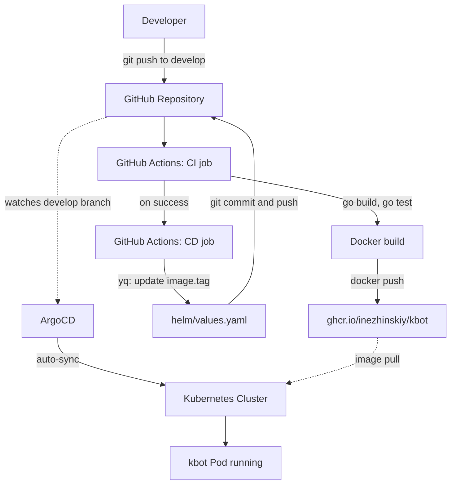

# kbot

## Link to telegram bot 

    https://t.me/inezhinskiy_bot

## Installation

1. Clone the repository:
```bash
git clone https://github.com/yourusername/kbot.git
cd kbot
```

2. Set up your Telegram Bot Token:
```bash
export TELE_TOKEN="your_telegram_bot_token"
```

3. Build the application:
```bash
make build
```

4. Run the application:
```bash
./kbot start
```

5. Push image 
```bash
make push
```

## Usage 

    /start hello


## CI/CD Pipeline

