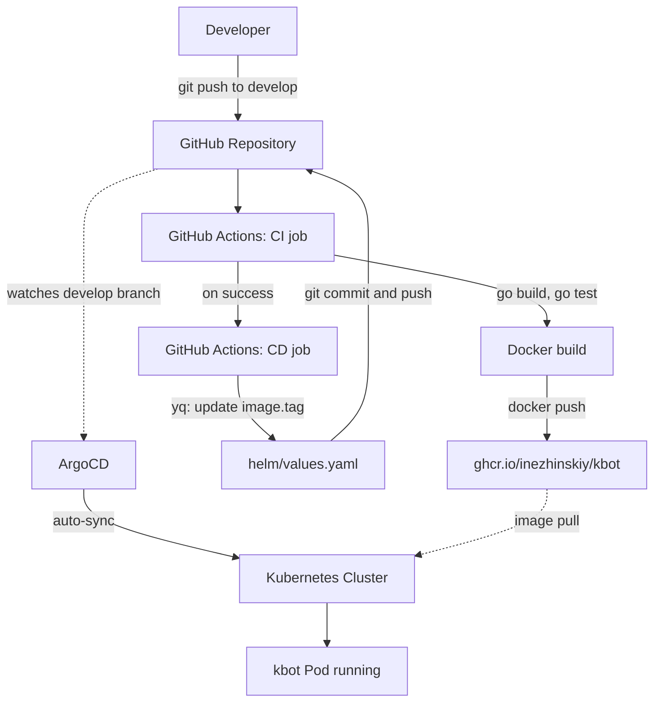

# kbot

A Telegram bot written in Go, used as a sandbox for a complete build-and-deploy pipeline: containerization, CI on GitHub Actions, Helm packaging and GitOps delivery to Kubernetes with ArgoCD.

Try it: [@inezhinskiy_bot](https://t.me/inezhinskiy_bot) — send `/start hello`.

## What's inside

- **Go app:** CLI built with [cobra](https://github.com/spf13/cobra), Telegram integration with [telebot v3](https://github.com/tucnak/telebot); version injected at build time from the Git tag and commit
- **Makefile:** `format`, `lint`, `test`, `build`, `image`, `push` targets with configurable `TARGETOS` / `TARGETARCH`
- **Docker:** multi-stage build into a minimal `scratch` image (static binary + CA certificates), published to `ghcr.io/inezhinskiy/kbot`
- **Helm chart** in [`helm/`](./helm)
- **CI/CD:** GitHub Actions (below) and an alternative Jenkins declarative pipeline in [`pipeline/jenkins.groovy`](./pipeline/jenkins.groovy)

## CI/CD pipeline


```mermaid
flowchart TD
    A[Developer] -->|git push to develop| B[GitHub Repository]
    B --> C[GitHub Actions: CI job]
    C -->|go build, go test| D[Docker build]
    D -->|docker push| E[ghcr.io/inezhinskiy/kbot]
    C -->|on success| F[GitHub Actions: CD job]
    F -->|yq: update image.tag| G[helm/values.yaml]
    G -->|git commit and push| B
    B -.->|watches develop branch| H[ArgoCD]
    H -->|auto-sync| I[Kubernetes Cluster]
    E -.->|image pull| I
    I --> J[kbot Pod running]
```

A push to `develop` builds and tests the app, pushes a new image, and bumps `image.tag` in the Helm values. ArgoCD watches the branch and syncs the new version to the cluster automatically — no manual `kubectl` or `helm upgrade`.

## Run locally

```bash
git clone https://github.com/inezhinskiy/kbot.git
cd kbot

export TELE_TOKEN="<your_telegram_bot_token>"

make build
./kbot start
```

Build and push an image for another platform:

```bash
make image push TARGETOS=linux TARGETARCH=arm64
```
